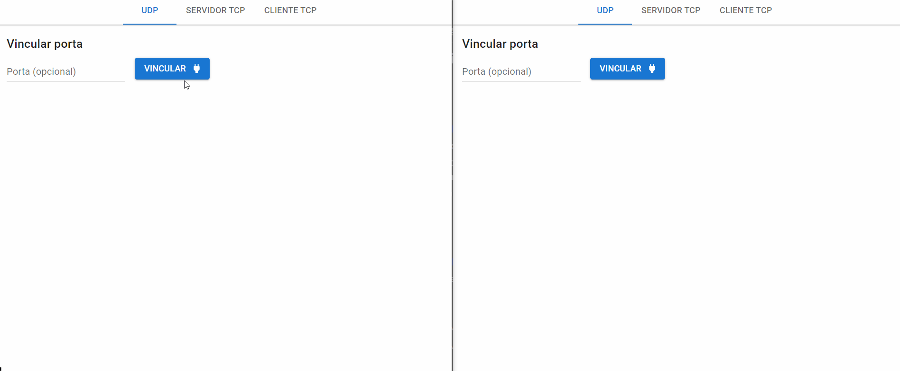
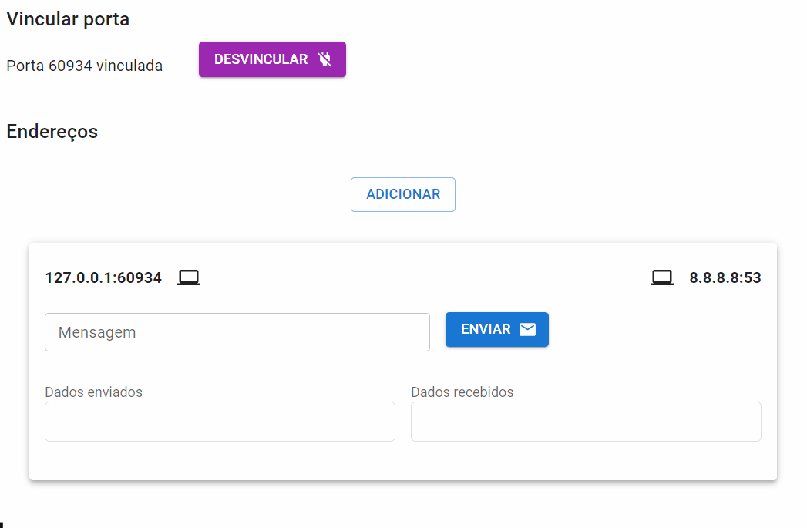
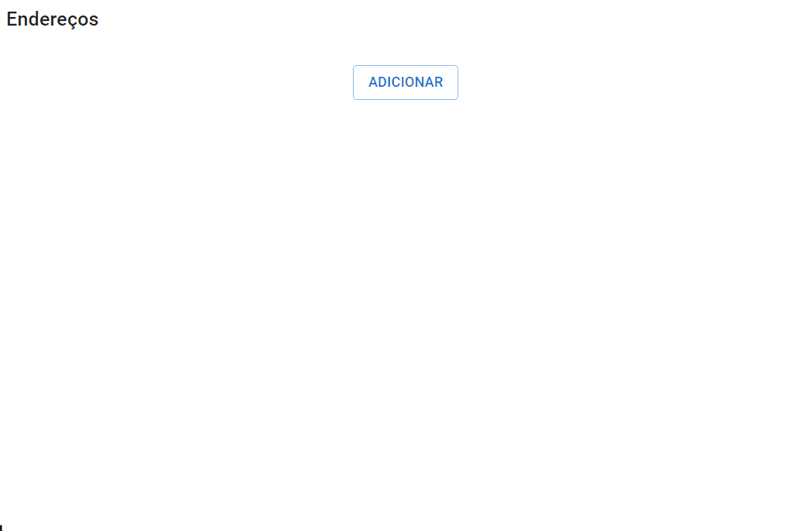

# PatiNET - Aplicação Cliente/Servidor UDP e TCP

> English version: [README.en.md](README.en.md)

PatiNET é uma aplicação Electron fácil de usar para lidar com comunicação cliente/servidor tanto em UDP quanto em TCP. Este README irá guiá-lo sobre como usar o PatiNET como usuário final ou desenvolvedor.

## Índice

- [Recursos](#recursos)
- [Uso](#uso)
  - [Baixando o Aplicativo](#baixando-o-aplicativo)
  - [Comunicação UDP](#comunicação-udp)
  - [Comunicação TCP](#comunicação-tcp)
- [Desenvolvedores](#desenvolvedores)
- [Relatando Problemas](#relatando-problemas)
- [Contribuindo](#contribuindo)
- [Licença](#licença)

## Recursos

- Disponível para Windows, macOS e Linux.
- Suporta os protocolos UDP e TCP.
- Permite usar nomes de domínio ou endereços IP para endereços remotos.
- Você pode escolher uma porta local para se vincular ou deixar isso para o sistema operacional.
- As mensagens podem ser lidas e escritas tanto em texto simples quanto em modo binário. No modo de texto simples, as linhas podem ser quebradas pressionando Enter (útil para criar requisições HTTP, por exemplo)

## Uso

### Baixando o Aplicativo

Para usar o PatiNET, siga estas etapas para baixar o arquivo apropriado na seção de Lançamentos:

1. Visite a página de [Lançamentos](https://github.com/megatron0000/PatiNET/releases) no repositório GitHub do PatiNET.
2. Role para baixo até o lançamento mais recente.
3. Dependendo do seu sistema operacional, baixe o binário apropriado para o PatiNET. `patinet-xxx.Setup.exe` instala no Windows, `patinet_xxx_amd64.deb` instala no Linux e `patinet-xxx-x64.dmg` instala no macOS. Aqui, `xxx` representa o número da versão (prefira a versão mais recente). Os outros arquivos zip são para executar o programa sem instalação.
4. Uma vez que o download estiver completo, instale e execute o PatiNET em seu computador (a menos que você tenha baixado o arquivo zip, que não requer instalação)

### Comunicação UDP

1. Abra o PatiNET.
2. Clique na aba "UDP".
3. Clique em "Vincular" para se vincular a uma porta. Se você deixar o campo em branco, uma porta aleatória será atribuída.
4. Clique em "Adicionar" para adicionar um endereço remoto. Digite o endereço IP (ou nome de domínio) e porta do servidor com o qual deseja se comunicar.
5. Digite sua mensagem no campo de entrada e clique no botão "Enviar".

**Exemplos**:

<details>
<summary>Exemplo UDP simples. Os botões "10" e "16" são as visualizações binárias dos dados (base 10 e base 16)</summary>



</details>

<details>
<summary>Falando com o DNS do Google (8.8.8.8:53). Criamos manualmente uma requisição DNS (base 16) pedindo o IP do facebook.com e então o enviamos para o servidor DNS do Google. Lemos a resposta na base 10, onde os quatro últimos bytes são o endereço IPv4 que pedimos</summary>



</details>

### Comunicação TCP

#### Modo Cliente

1. Abra o PatiNET.
2. Clique na aba "Cliente TCP".
3. Clique em "Adicionar" para adicionar um endereço remoto. Digite o endereço IP (ou nome de domínio) e porta do servidor com o qual você deseja se comunicar. A porta local pode ser deixada em branco (isso atribuirá uma porta aleatória)
4. Clique em "Conectar" para iniciar a conexão TCP com o host remoto.
5. Digite sua mensagem no campo de entrada e clique no botão "Enviar".
6. A qualquer momento, você pode clicar em "Desconectar" para encerrar a conexão.

**Exemplos**:

<details>
<summary>Falando com example.com na porta 80 (HTTP)</summary>



</details>

#### Modo Servidor

1. Abra o PatiNET.
2. Clique na aba "Servidor TCP".
3. Espere por um cliente se conectar. Quando ele fizer isso, você verá um painel semelhante ao do Cliente TCP.

## Desenvolvedores

1. **Faça um Fork do Repositório**: Faça um fork do repositório do projeto e clone seu fork para seu computador local.

   ```bash
      git clone https://github.com/megatron0000/PatiNET.git
   ```

2. **Navegue até seu clone**: Abra um terminal e navegue até o diretório clonado.

   ```bash
   cd PatiNET
   ```

3. **Instale as Dependências**: Use o npm para instalar todos os pacotes necessários.

   ```bash
   npm install
   ```

4. **Execute o Aplicativo**: Inicie o aplicativo usando o npm. Isso usará o webpack e recarregará automaticamente sempre que você fizer uma alteração no código-fonte.

   ```bash
   npm start
   ```

## Relatando Problemas

Se você encontrar um problema, por favor [registre um relatório de erro](https://github.com/megatron0000/PatiNET/issues). Ao relatar um problema, certifique-se de responder a estas cinco perguntas:

1. Qual versão do projeto você está usando? exemplo: 1.0.1
2. Qual sistema operacional e arquitetura de processador você está usando? exemplo: sistema operacional Ubuntu com CPU AMD Ryzen
3. O que você fez? exemplo: abriu o aplicativo no modo UDP, adicionou um remoto e enviou uma mensagem
4. O que você esperava ver? exemplo: a mensagem deveria ser enviada
5. O que você viu em vez disso? exemplo: apareceu um erro e ele disse [mensagem de erro aqui]

## Contribuindo

Aceitamos contribuições para melhorar o PatiNET. Sinta-se à vontade para abrir problemas ou pull requests com suas ideias, relatórios de bugs ou solicitações de recursos.

## Licença

Este projeto está licenciado sob a Licença MIT - consulte o arquivo [LICENSE.md](LICENSE.md) para obter mais informações.
